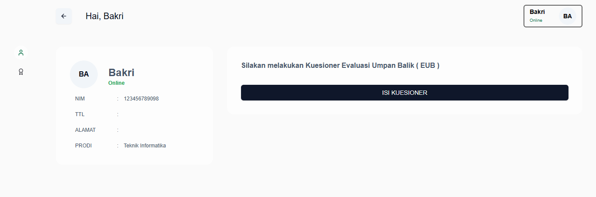
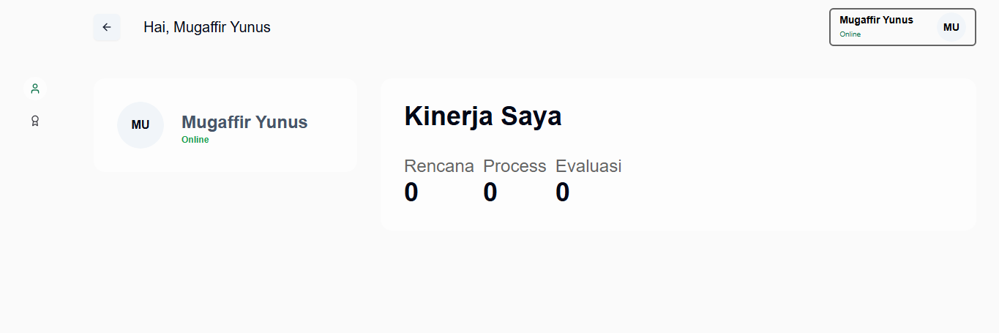
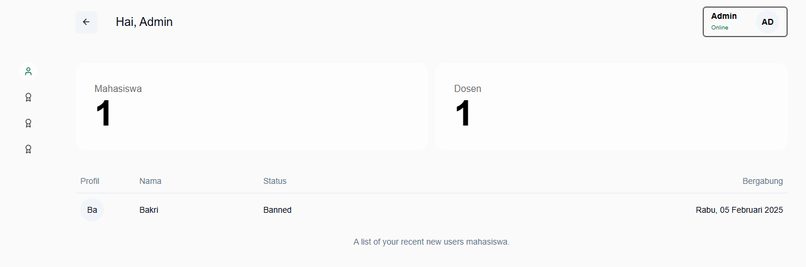

# Performance of Dosen Web Application

## Table of Contents

- [Overview](#overview)
- [Features](#features)
- [Resources](#resources)
- [Technologies Used](#technologies-used)
    - [Frontend](#frontend)
    - [Backend](#backend)
- [Getting Started](#getting-started)
- [Acknowledgments](#acknowledgments)

## Overview

Performance of Dosen is a full-stack web application that enables users to handle quesioner.

## Features

- User Authentication: All of features authentication.
- Quesioner: Users can send, and archive their quesioner.
- Performance: Users can see dashboard performance their quesioner.
- Admin: Users can manage all data like teacher, and class.

## Resources

- Page View Users (Siswa)



- Page View Users (Teacher)



- Page View Users (Admin)




## Technologies Used

### Frontend

- NodeJs
- React (Framework NextJs)
- TailwindCSS (With Shadcn UI)
- Better Auth
- React Query
- React Hook Form
- Pipeline CI/CD
- Docker

### Backend

- NodeJs
- NextJs Handler
- Kysely
- PostgreSQL
- Pipeline CI/CD
- Docker

## Getting Started

To get started with the Performance of Dosen web application project, follow the setup instructions in the respective directories:

- [Instructions](README.md)

#### Instal All Module

Note: Don't forget to install nvm, becouse this project using node and npm for build tool.

```
npm install --legacy-peer-deps
```

#### Generate Table

Note: Don't forget to generate authentication tables.

```
npm better:auth:generate
```

#### Migrate Table

Note:

Don't forget to migrate all authentication tables.
For feature tables using with migrate manualy using sql command in tool management Adminer.

```
npm better:auth:migrate
```

#### Run Dev for (run development server) 👍

```
npm run dev
```

#### Run Build for (run with production server) 👍

```
npm run build
```

#### Run Start (don't forget to run build) 👍

```
npm run start
```

#### Run with Docker (include with database postgre SQL and Adminer as Management Tool) 👍

```
docker compose --file=docker/staging/compose.yml --env-file=.env up -d
```

## Acknowledgments

Special thanks to the developers and maintainers of the technologies used in this project. Their hard work and dedication make projects like this possible.
